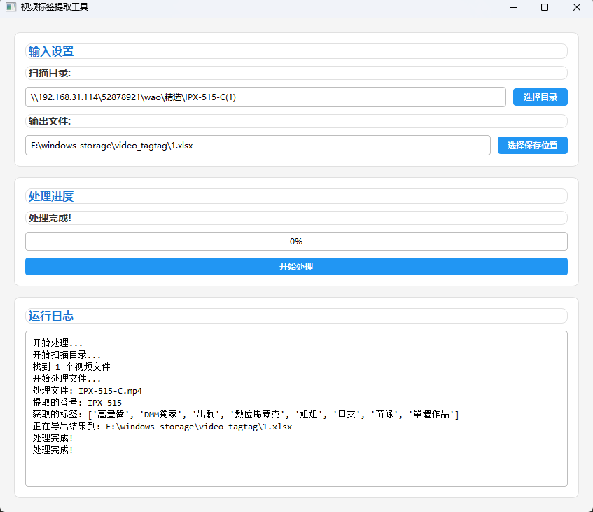

# 视频标签提取工具

这是一个用于从视频文件名中提取番号并获取相关标签的工具。



## 功能特点

- 扫描指定目录下的视频文件
- 使用大语言模型提取文件名中的番号
- 自动爬取网页获取视频标签
- 将结果导出为Excel文件
- 图形用户界面，操作简单
- 可配置的参数设置

## 安装依赖

```bash
pip install -r requirements.txt
```

## 配置说明

编辑 `config.yaml` 文件来配置以下参数：

- `file_size`: 视频文件大小限制（MB）
- `openai`: OpenAI API配置
  - `api_endpoint`: API端点
  - `api_key`: API密钥
  - `model`: 使用的模型
- `request`: 网页请求配置
  - `delay`: 请求间隔（秒）
  - `timeout`: 超时时间（秒）
  - `retries`: 重试次数
- `llm`: 大语言模型调用配置
  - `delay`: 调用间隔（秒）
  - `max_tokens`: 最大token数
  - `temperature`: 温度参数
- `output`: 输出配置
  - `default_excel_path`: 默认Excel输出路径

## 使用方法

1. 运行程序：
先去复制config-example.yaml文件，并命名为config.yaml，然后修改config.yaml文件中的api_key，api_endpoint，model参数。
然后apikey可以去https://siliconflow.cn/申请。
```bash
python main.py
```

2. 在GUI界面中：
   - 选择要扫描的目录
   - 选择Excel输出路径
   - 点击"开始处理"按钮

3. 等待处理完成，结果将保存到指定的Excel文件中

## 输出格式

Excel文件包含以下列：
- name: 文件名
- path: 文件路径
- code: 提取的番号
- tags: 获取的标签（逗号分隔） 